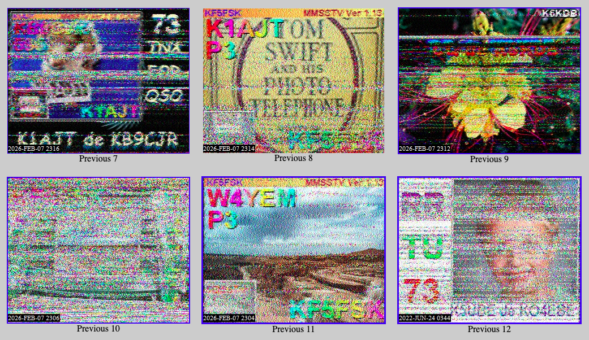

## Un sistema de conocimiento que desafía la obsolescencia

Este entrada es parte de una serie que piensa el **markdown** no como una simple sintaxis, sino como la culminación digital de una tradición de siglos. La jerarquía de `#`, `##` y `###` replica el sistema de títulos, capítulos y secciones estandarizado con los códices medievales y la imprenta de tipos móviles. Markdown es la automatización de las marcas tipográficas que los autores escribían a mano para indicar al impresor qué era un título.

## Formato abierto, texto simple

A diferencia de los formatos propietarios como `.doc`, `.pages` o incluso `.pdf` — que dependen de software específico, a menudo obsoleto o de suscripción — el texto plano es "legible por humanos" incluso si la máquina que debe interpretarlo deja de existir. Markdown apuesta por el contenido puro: separa el fondo (el texto) de la forma (el CSS de Gulp).

En archivística digital se dice que, para que algo sea eterno, debe ser simple. Markdown aplica una jerarquía semántica pura:

- `#` significa "importancia máxima".
- `*` significa "énfasis".

Esta lógica es independiente del renderizado, un sistema de acceso universal que elimina los metadatos invisibles que suelen corromper los archivos con el paso del tiempo.

## Pandoc: el traductor universal

> Rosetta es el nombre de este proyecto porque aspira a ser una piedra de Rosetta: **el mismo markdown, en mil formatos**.

Pandoc (literalmente "toda conversión") es el traductor de documentos por excelencia: lee markdown y escribe HTML, PDF, LaTeX, docx, epub y decenas de formatos más, usando el mismo archivo fuente. Aquí combina con Gulp para generar el sitio estático y con LaTeX (vía `xelatex`) para el PDF con efecto halftone.

### Un ejemplo de código

```bash
pandoc entrada.md -o entrada.html --template=layout.html
```

_Este contenido es una instancia de prueba semántica; el pipeline de Rosetta lo compila igual que lo hará con las entradas futuras._

